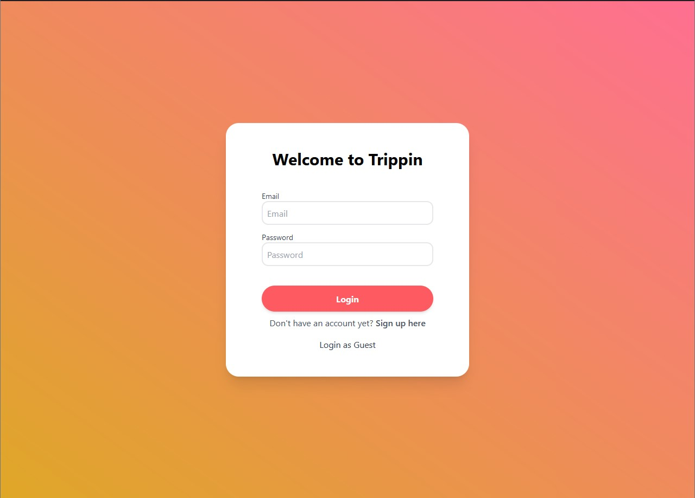
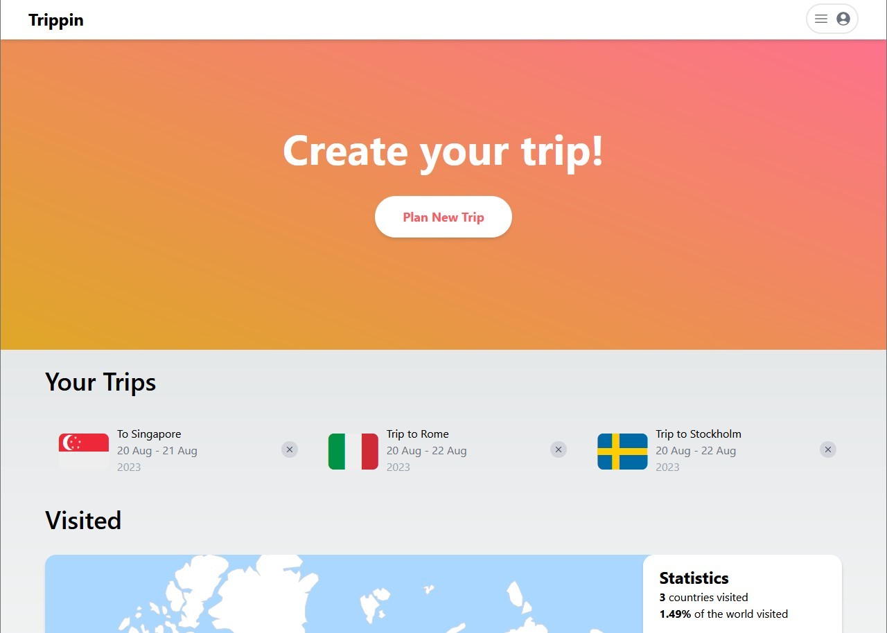
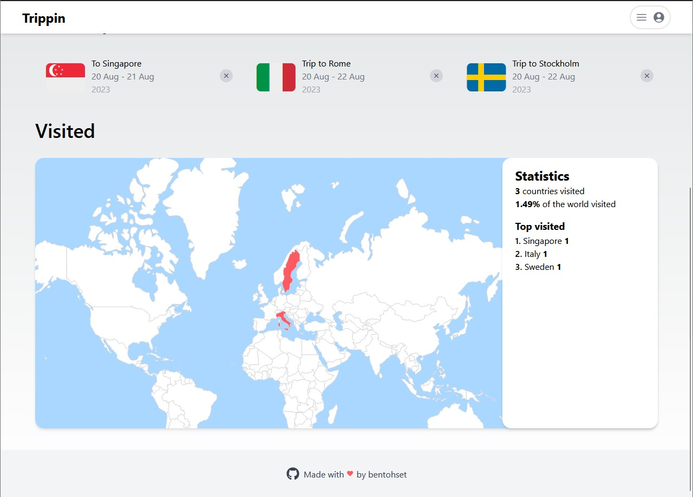
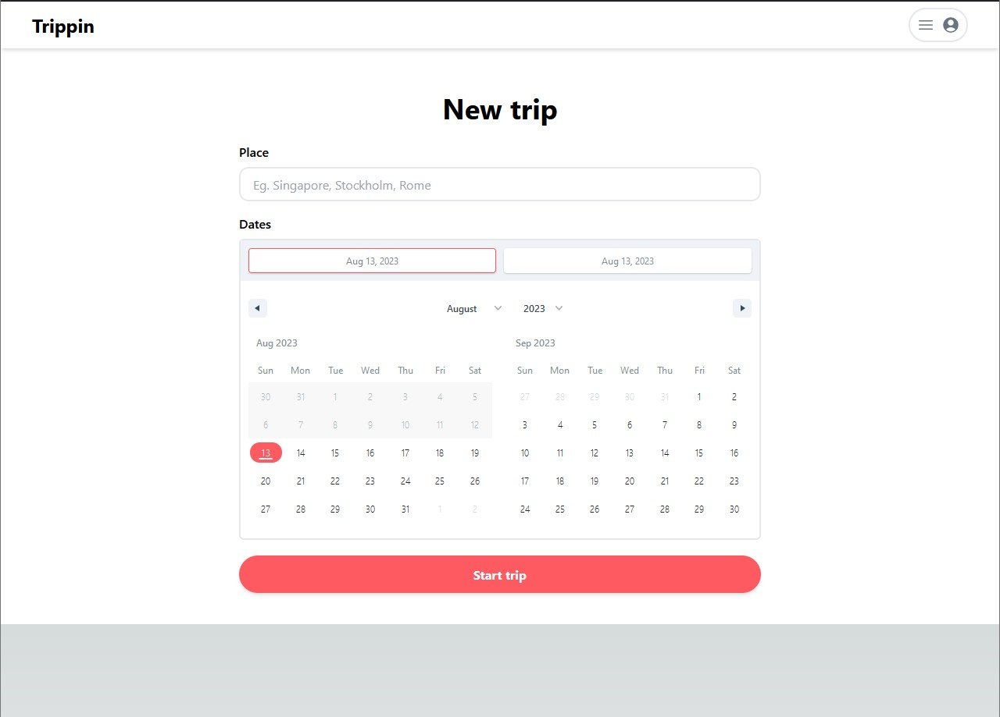
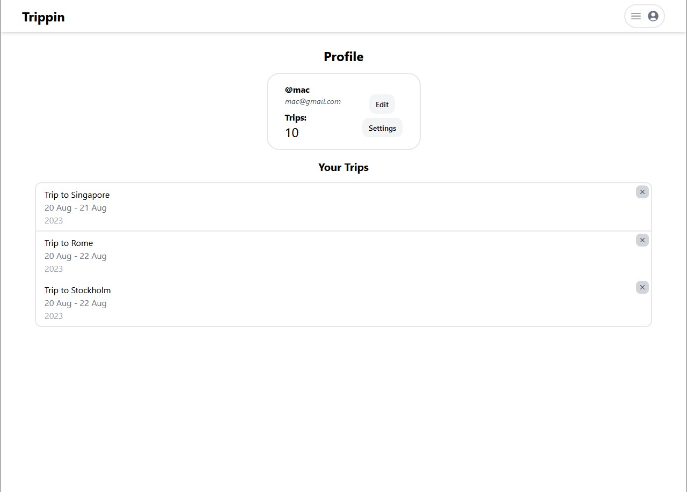
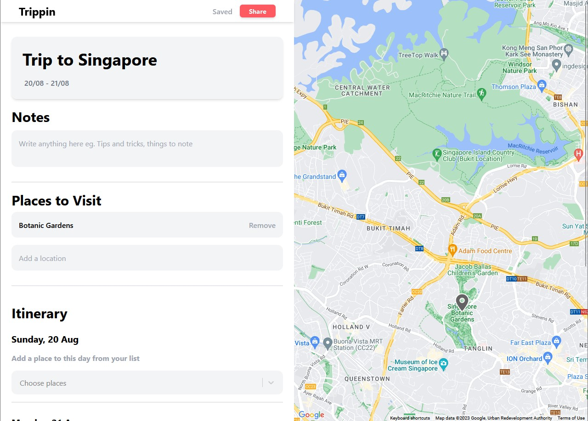
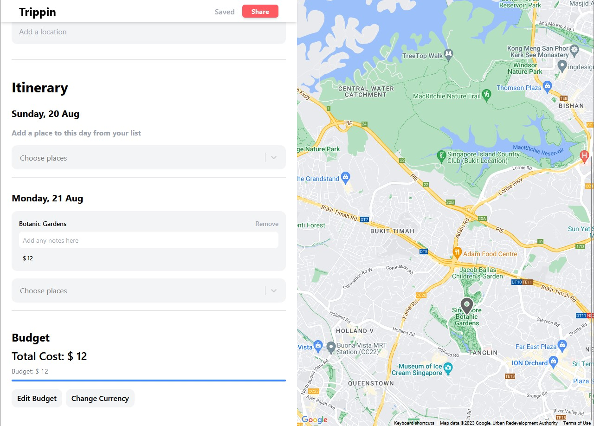

# Trippin
A trip planner web app with real-time collaboration and location-based planning.

Try out trippin [here](https://trippin-web.vercel.app/)!

## Table of Contents
- [About](#about)
    - [Motivation](#motivation)
    - [Features](#features)
    - [Tech Stack](#tech-stack)
- [Screenshots](#screenshots)
    - [Authentication](#authentication)
    - [Main page](#main-page)
    - [New Trip](#new-trip-page)
    - [Profile](#profile-page)
    - [Plan page](#plan-page)
- [Setup](#setup)
- [Plan](#plan)


## About
### Motivation
This project came about the problem of planning trips as a group. Using current apps like Google sheets and maps required one to constantly switch between tabs which proved to be cumbersome.
Trippin offers a map side-by-side with a planner in addition to real-time collaboration to solve this problem.

### Features
1. Real-time collaboration
2. Google Maps interface
3. Autocomplete locations
4. Planner
    a. Itinerary for each day
    b. Budget tracking
    c. Additional notes
5. Summary statistics and visualisation (shade-off-the-map)

### Tech Stack
Frontend: Next.js, React, TailwindCSS, MaterialUI
Backend: Node.js, Express.js, MongoDB
Websockets: SocketIO
APIs: Google Maps, Mapbox

## Screenshots
### Authentication

- Utilizes JWT authentication and session-based cookies
- Guest mode which disables the collaboration feature (stores data on local storage)
- Register and Login with email

### Main Page

- List of all current made trips
- Responsive UI and mobile-first development


- Summary statistics and visualization for visited places
    - To incentivize travelling and using the app


### New Trip Page

- Create trips based on location and dates
- Places are autocompleted with Mapbox API
- Date range picker
    - Responsive and will shorten to a 1-month calendar

### Profile Page

- Username, email and number of trips
- List of all trips
    - Pending pagination
- Pending UI revamp

### Plan Page


- Google Maps side by side with a marker everytime a new place is given
- Title
- Notes
- Places to visit with autocomplete using Google Maps API
    - Input all places on user's travel wishlist before planning itinerary


- After completing Places to visit, users can select from a dropdown according to the data they wish to visit that place
    - Places can be repeated
- Additional notes and the budget for that place can be given
- Budget tracking with progress bar
    - Users can set a budget to track overall expenses during planning
- Currency can be set which updates the whole form
    - Note that it does not convert the cost to that currency


## Setup
1. Clone the repository
2. Open a terminal for the frontend
```
cd frontend
npm i
npm run dev
```

3. Open another terminal for the backend

```
cd backend
npm i
npm run app
```

4. Ensure .env variables are set appropriately

Frontend:
```
NEXT_PUBLIC_DEV_URL=
NEXT_PUBLIC_DEV_API_URL=
NEXT_PUBLIC_PROD_URL=
NEXT_PUBLIC_PROD_API_URL=
NEXT_PUBLIC_GOOGLEMAPS_KEY=
NEXT_PUBLIC_MAPBOX_KEY=
```

Backend:
```
MONGO_KEY=
MAPBOX_KEY=
JWT_SECRET=
JWT_EXPIRY=
```

## Plan
This is the overall versioning plan of the app and what features it includes

| Version | Plan                                     | Status  |
|---------|------------------------------------------|---------|
| 1.0     | Autosave feature for 1 user + Guest mode | Done    |
| 2.0     | Collaboration with websockets            | Done    |
| 2.1     | UI changes: Map + Profile                | Pending |